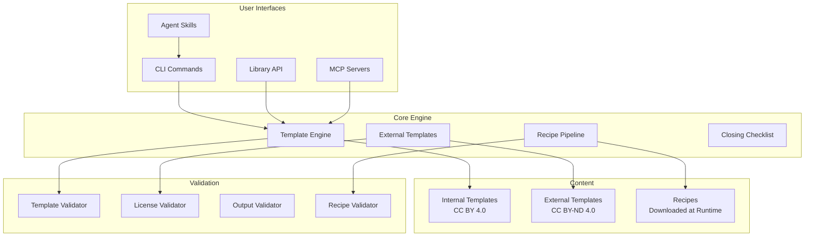

OpenAgreements is a TypeScript-based legal template filling engine with CLI, library API, and MCP server capabilities.

## Core Technology Stack

- **Language**: TypeScript (Node.js >= 20)
- **DOCX Engine**: [docx-templates](https://www.npmjs.com/package/docx-templates) (MIT)
- **CLI Framework**: [Commander.js](https://www.npmjs.com/package/commander)
- **Schema Validation**: [Zod](https://www.npmjs.com/package/zod)
- **Testing**: Vitest with Allure reporting
- **Build**: TypeScript compiler (tsc)

## System Overview



## Directory Structure

### Source Code (`src/`)

```
src/
├── cli/                    # Commander.js CLI entry point
├── commands/               # CLI command implementations
│   ├── fill.ts             # Template filling
│   ├── list.ts             # Template listing
│   ├── validate.ts         # Template validation
│   ├── recipe.ts           # Recipe operations
│   ├── scan.ts             # Metadata scanning
│   └── checklist.ts        # Closing checklist operations
├── core/
│   ├── engine.ts           # docx-templates wrapper
│   ├── metadata.ts         # Zod schemas + YAML loader
│   ├── fill-pipeline.ts    # Fill orchestration
│   ├── unified-pipeline.ts # Unified fill logic
│   ├── template-listing.ts # Template discovery
│   ├── selector.ts         # Template selection
│   ├── recipe/             # Recipe pipeline
│   │   ├── cleaner.ts      # Source document cleaning
│   │   ├── patcher.ts      # XML patching
│   │   ├── verifier.ts     # Output verification
│   │   ├── downloader.ts   # Source downloading
│   │   └── source-drift.ts # Drift detection
│   ├── external/           # External template support
│   │   ├── index.ts        # External fill pipeline
│   │   └── types.ts        # External metadata types
│   ├── validation/         # Validation subsystem
│   │   ├── template.ts     # Template validation
│   │   ├── license.ts      # License validation
│   │   ├── output.ts       # Output validation
│   │   ├── recipe.ts       # Recipe validation
│   │   └── external.ts     # External validation
│   ├── checklist/          # Closing checklist engine
│   │   ├── schemas.ts      # Zod schemas
│   │   ├── state-manager.ts # State management
│   │   ├── patch-*.ts      # JSON patch operations
│   │   ├── jsonl-stores.ts # JSONL persistence
│   │   └── docx-import.ts  # DOCX import
│   └── command-generation/
│       ├── types.ts        # ToolCommandAdapter interface
│       └── adapters/
│           └── claude.ts   # Claude Code adapter
├── utils/
│   └── paths.ts            # Path resolution
└── index.ts                # Public API exports
```

### Content (`content/`)

```
content/
├── templates/              # Internal templates (CC BY 4.0)
│   ├── common-paper-mutual-nda/
│   │   ├── template.docx
│   │   ├── metadata.yaml
│   │   └── README.md
│   └── [28 templates...]
├── external/               # External templates (CC BY-ND 4.0)
│   ├── yc-safe-postmoney/
│   │   ├── template.docx
│   │   ├── metadata.yaml
│   │   └── README.md
│   └── [4 templates...]
└── recipes/                # Recipes (downloaded at runtime)
    ├── nvca-indemnification-agreement/
    │   ├── metadata.yaml
    │   ├── recipe.yaml
    │   └── README.md
    └── [7 recipes...]
```

### Packages (Monorepo)

```
packages/
├── docx-core/                      # Core DOCX utilities
├── contracts-workspace/            # Workspace management CLI
├── contracts-workspace-mcp/        # Workspace MCP server
├── contract-templates-mcp/         # Template drafting MCP server
├── checklist-mcp/                  # Closing checklist MCP server
└── allure-test-factory/            # Test utilities
```

## Core Components

### Template Engine

The template engine wraps [docx-templates](https://www.npmjs.com/package/docx-templates) to provide:

**Location:** `src/core/engine.ts`

**Key Functions:**
- `fillTemplate(templatePath, data, outputPath)` — Fill a DOCX template with data
- Preserves all original formatting (styles, fonts, numbering, headers/footers)
- Supports `{tag}` placeholder syntax
- Validates field coverage (all required fields provided)

**Data Flow:**
```
Template DOCX → Parse XML → Replace {tags} → Repack ZIP → Output DOCX
```

### Recipe Pipeline

Handles non-redistributable documents (NVCA model documents).

**Location:** `src/core/recipe/`

**Pipeline Stages:**

1. **Download** (`downloader.ts`)
   - Fetch source DOCX from publisher URL
   - Verify SHA-256 hash
   - Cache locally

2. **Clean** (`cleaner.ts`)
   - Remove guidance (footnotes, comments, drafting notes)
   - Extract guidance to JSON (optional)
   - Normalize brackets and smart quotes
   - Apply declarative prune rules

3. **Patch** (`patcher.ts`)
   - Apply XML patches to insert `{tags}`
   - Support for text runs, table cells, paragraphs
   - Computed fields (e.g., `{party_count}`)

4. **Fill** (unified pipeline)
   - Use standard template engine
   - Fill with user data

5. **Verify** (`verifier.ts`)
   - Structural checks (sections, tables, numbering)
   - Placeholder check (no unfilled `{tags}`)
   - Content validation (expected text present)

**Source Drift Detection:**
- Compute structural signature (section/table/paragraph counts)
- Compare against expected signature in `recipe.yaml`
- Alert if source document has changed (publisher update)

### External Templates

Supports CC BY-ND 4.0 templates (Y Combinator SAFEs).

**Location:** `src/core/external/`

**Key Differences from Internal Templates:**
- No modification of source DOCX (ND = No Derivatives)
- Vendor unchanged source
- Transient derivative output (exists only on user's machine)
- No `{tag}` placeholders — use value replacement strategies

### Closing Checklist Engine

Transaction closing checklist with state management and DOCX export.

**Location:** `src/core/checklist/`

**Features:**
- Zod schemas for checklists, documents, action items, issues
- JSON Patch operations for state updates
- JSONL persistence stores (validation, applied patches, proposed patches)
- DOCX import/export with table parsing
- State labels: `todo`, `in_progress`, `blocked`, `done`, `waived`, `n/a`

### Metadata System

YAML metadata with Zod validation.

**Location:** `src/core/metadata.ts`

**Schema Types:**
- `TemplateMetadata` — Internal templates
- `RecipeMetadata` — Recipe instructions
- `ExternalMetadata` — External templates
- `CleanConfig` — Recipe cleaning rules

**Key Fields:**
```yaml
name: common-paper-mutual-nda
license: CC BY 4.0
source: https://commonpaper.com/standards/mutual-nda
fields:
  - id: party_1_name
    label: First Party Name
    type: text
    required: true
    section: parties
```

### Command Generation

Agent-agnostic command adapter interface.

**Location:** `src/core/command-generation/`

**Interface:**
```typescript
interface ToolCommandAdapter {
  generateListCommand(): string;
  generateFillCommand(template: string, data: Record<string, unknown>): string;
  parseListOutput(output: string): TemplateListItem[];
}
```

**Adapters:**
- `ClaudeCodeAdapter` — Claude Code plugin format

## Validation Pipeline

Multi-layer validation ensures quality and compliance.

**Location:** `src/core/validation/`

### Template Validation (`template.ts`)

- Template DOCX exists and is valid ZIP
- Metadata YAML is valid and complete
- All `{tags}` in DOCX have field definitions
- Required sections present
- No placeholder collisions

### License Validation (`license.ts`)

- License is valid enum value: `CC BY 4.0`, `CC0`, `CC BY-ND 4.0`, `Proprietary`
- Source URL is valid and accessible
- Attribution requirements met

### Output Validation (`output.ts`)

- Output DOCX is valid ZIP
- No unfilled `{tags}` remain
- Expected content sections present
- Formatting preserved (styles, fonts, numbering)

### Recipe Validation (`recipe.ts`)

- Source URL is valid
- Expected SHA-256 hash matches
- Cleaner config is valid
- Patch operations are valid XML
- Verification checks are complete

## Optional Content Roots

Supports unbundling large form libraries.

**Environment Variable:** `OPEN_AGREEMENTS_CONTENT_ROOTS`

**Format:** Path-delimited list (`:` on Unix, `;` on Windows)

**Example:**
```bash
export OPEN_AGREEMENTS_CONTENT_ROOTS="/opt/legal-forms:/home/user/templates"
```

**Lookup Precedence:**
1. Roots in `OPEN_AGREEMENTS_CONTENT_ROOTS` (in listed order)
2. Bundled package content (default fallback)

**Expected Structure:**
```
{root}/
├── templates/
├── external/
└── recipes/
```

## Testing Architecture

### Test Framework

- **Unit Tests**: Vitest with collocated `.test.ts` files
- **Integration Tests**: `integration-tests/` directory
- **Coverage**: Vitest coverage with lcov reporter
- **Reporting**: Allure with custom test factory

### OpenSpec Traceability

**Script:** `scripts/validate_openspec_coverage.mjs`

**Purpose:** Enforce test coverage for OpenSpec scenarios

**Matrix Export:** `integration-tests/OPENSPEC_TRACEABILITY.md`

### Source Drift Canary

**Script:** `scripts/source_drift_canary.mjs`

**Purpose:** Verify expected source hash plus structural replacement/normalize anchors for recipes

**Triggers:** CI on pull requests and pushes to `main`

## Deployment Targets

### NPM Package

**Package:** `open-agreements`

**Entry Points:**
- Binary: `bin/open-agreements.js`
- Library: `dist/index.js`
- Types: `dist/index.d.ts`

**Execution Modes:**
- Global install: `npm install -g open-agreements`
- npx: `npx -y open-agreements@latest`
- Local require: `import { fillTemplate } from 'open-agreements'`

### MCP Servers

**Packages:**
- `@open-agreements/contracts-workspace-mcp` — Workspace operations
- `@open-agreements/contract-templates-mcp` — Template drafting
- `@open-agreements/checklist-mcp` — Closing checklist

**Protocol:** Model Context Protocol (stdio transport)

**Clients:** Claude Code, Cursor, Gemini

### Hosted MCP Connector

**Endpoint:** `https://openagreements.ai/api/mcp`

**Implementation:** Remote MCP connector for fast setup

**Data Flow:** Agreement content sent to hosted service endpoint

**Recommended Use:** Quick evaluation, convenience over local-only processing

## Trust Boundaries

### Local Execution Mode

- Processing runs on user-controlled machine
- No hosted connector hop
- Normal package/source downloads (npm, recipe sources)
- Local filesystem artifacts

**Recommended for:** Sensitive workflows, internal review paths requiring local control

### Hosted MCP Mode

- Processing runs on `openagreements.ai` hosted service
- Agreement request/response content sent to endpoint
- Hosted service and client/provider logs

**Recommended for:** Quick evaluation, first-time setup, convenience

**See:** [Trust Checklist](/advanced/trust-checklist) for detailed data flow analysis

## CI/CD Pipeline

### GitHub Actions Workflows

**Workflow:** `.github/workflows/ci.yml`

**Gates:**
- Lint (ESLint)
- Build (TypeScript compilation)
- Test (Vitest with coverage)
- Validate (all templates and recipes)
- Spec coverage (OpenSpec traceability)
- Template previews
- Isolated runtime smoke test

**Release Workflow:** `.github/workflows/release.yml`

**Gates:**
- Tag must match package versions
- Release commit must be in `origin/main`
- All CI gates must pass
- Publish to npm with provenance (OIDC)

### Quality Metrics

- **Code Coverage:** Codecov with patch/project gates (see `codecov.yml`)
- **Test Results:** JUnit XML for Codecov test analytics
- **OpenSpec Traceability:** `npm run check:spec-coverage`
- **Source Drift:** `npm run check:source-drift`
- **LibreOffice Rendering:** `npm run check:libreoffice`

## Design Principles

### 1. Agent-Agnostic

Support multiple AI coding assistants through adapter pattern:
- Claude Code
- Cursor
- Gemini
- Any MCP-compatible client

### 2. Local-First

Prioritize local execution with optional hosted convenience:
- No required external dependencies
- Hosted mode is opt-in
- Clear trust boundary documentation

### 3. IP-Clean

- Public domain references (NIST SP 800-53)
- CC BY 4.0 / CC0 templates (redistributable)
- Recipe-based handling of proprietary sources
- No copyrighted text in codebase

### 4. Quality Gates

- TypeScript strict mode
- Zod schema validation
- Comprehensive test coverage
- OpenSpec traceability
- Source drift detection

### 5. Extensible Content

- Optional content roots for unbundling
- Pluggable template sources
- Recipe system for non-redistributable content
- Clear contribution guidelines

## Resources

- [Source Repository](https://github.com/open-agreements/open-agreements)
- [NPM Package](https://www.npmjs.com/package/open-agreements)
- [API Documentation](https://usejunior.com/developer-tools/open-agreements)
- [MCP Specification](https://spec.modelcontextprotocol.io/)

## Next Steps

<CardGroup cols={2}>
  <Card title="Compliance Skills" icon="shield-check" href="/advanced/compliance-skills">
    ISO 27001 and SOC 2 agent skills
  </Card>
  <Card title="Contributing" icon="code-pull-request" href="/advanced/contributing">
    Add templates, recipes, or improvements
  </Card>
  <Card title="Trust Checklist" icon="lock" href="/advanced/trust-checklist">
    Trust and security considerations
  </Card>
  <Card title="Template Guide" icon="file-plus" href="/templates/adding-templates">
    Add new templates or recipes
  </Card>
</CardGroup>