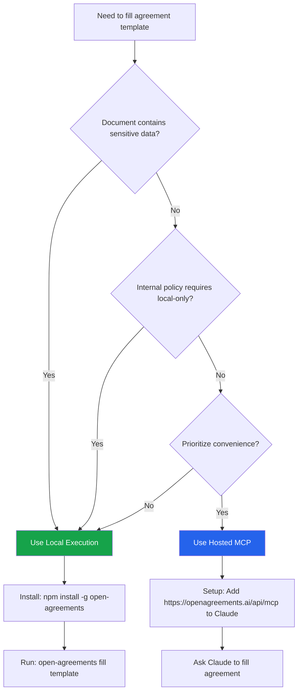

OpenAgreements supports two execution modes with different trust boundaries. This checklist helps you make a 60-second decision about which mode to use.

## Quick Decision

<CardGroup cols={2}>
  <Card title="Sensitive Documents" icon="lock" color="#16a34a">
    Use **fully local package execution** (`npx`, global install, or local stdio MCP package)
  </Card>
  <Card title="Convenience Priority" icon="rocket" color="#2563eb">
    Use **hosted remote MCP connector** (`https://openagreements.ai/api/mcp`)
  </Card>
</CardGroup>

**Important:** No single mode is globally recommended. Choose based on document sensitivity, internal policy, and workflow speed needs.

## Execution Modes

### Hosted Remote MCP Connector

**Endpoint:** `https://openagreements.ai/api/mcp`

**Data Flow:**
- Processing runs on hosted service endpoint at `openagreements.ai`
- Agreement request/response content sent to the hosted endpoint as part of connector use
- Hosted service and client/provider logs outside this repo's local execution path

**Recommended Use Cases:**
- Quick evaluation
- First-time setup
- Convenience in Claude
- Non-sensitive documents

**Not Recommended For:**
- High-sensitivity documents when policy requires local-only processing
- Organizations with strict data residency requirements
- Confidential agreements (NDAs with sensitive terms, employment contracts with personal data)

**Setup in Claude:**
```json
{
  "mcpServers": {
    "openagreements": {
      "url": "https://openagreements.ai/api/mcp"
    }
  }
}
```

### Fully Local Package Execution

**Modes:**
- `npx -y open-agreements@latest`
- `npm install -g open-agreements`
- Local stdio MCP packages:
  - `@open-agreements/contracts-workspace-mcp`
  - `@open-agreements/contract-templates-mcp`
  - `@open-agreements/checklist-mcp`

**Data Flow:**
- Agreement filling runs locally on user-controlled machine
- No hosted connector hop
- Normal package/source downloads you initiate (npm install, recipe source fetch)
- Local machine artifacts and any local tooling/shell logs configured by user

**Recommended Use Cases:**
- Sensitive workflows
- Internal review paths requiring local processing control
- Compliance requirements (ISO 27001, SOC 2)
- Organizations with data residency policies
- Confidential agreements

**Not Recommended For:**
- Teams that prioritize fastest hosted setup over local runtime control
- Users without Node.js >= 20 installed

**Setup for Local CLI:**
```bash
# Global install
npm install -g open-agreements
open-agreements list

# Or use npx
npx -y open-agreements@latest list
```

**Setup for Local MCP:**
```json
{
  "mcpServers": {
    "workspace": {
      "command": "npx",
      "args": ["-y", "@open-agreements/contracts-workspace-mcp"]
    },
    "templates": {
      "command": "npx",
      "args": ["-y", "@open-agreements/contract-templates-mcp"]
    },
    "checklist": {
      "command": "npx",
      "args": ["-y", "@open-agreements/checklist-mcp"]
    }
  }
}
```

## Data Flow Comparison

| Aspect | Hosted MCP | Local Execution |
|--------|-----------|----------------|
| **Where processing runs** | Hosted service endpoint on `openagreements.ai` | User-controlled machine/process |
| **What leaves device** | Agreement request/response content sent to the hosted endpoint | Agreement filling runs locally; no hosted connector hop |
| **Network activity** | All fill operations go through hosted service | Normal package downloads (npm, recipe sources) |
| **Logging/retention** | Hosted service and client/provider logs outside local execution path | Local machine artifacts and any local tooling/shell logs |
| **Setup complexity** | Minimal (add URL to config) | Requires Node.js >= 20 |
| **Speed** | Fast (hosted infrastructure) | Fast (local CPU) |
| **Offline capable** | No (requires internet) | Yes (after initial package download) |
| **Cost** | Free | Free |

## Security Considerations

### Local Execution Guarantees

✅ Agreement content never sent to external service  
✅ DOCX files stay on local filesystem  
✅ Field data processed in-memory locally  
✅ Output written to local disk  
✅ No telemetry or analytics  

### Hosted MCP Considerations

⚠️ Agreement content sent to `openagreements.ai`  
⚠️ Service logs may retain request metadata  
⚠️ Verify policy before sensitive use  
⚠️ Subject to hosted service availability  
⚠️ Internet connection required  

### Network Activity (Both Modes)

Both modes make normal package/source downloads:

- **npm package downloads** — When running `npx` or `npm install`
- **Recipe source downloads** — NVCA documents from `nvca.org` (recipes only)
- **Template source verification** — Checking Common Paper, Bonterms URLs for updates

These are standard package manager operations, not specific to OpenAgreements.

## Compliance Scenarios

### ISO 27001 / SOC 2 Compliance

**Requirement:** Evidence collection must not exfiltrate data

**Recommendation:** **Local execution only**

**Rationale:**
- Compliance skills (`iso-27001-evidence-collection`, `iso-27001-internal-audit`, `soc2-readiness`) are markdown-only
- No scripts executed, no secrets required
- Evidence stays local
- Audit trail is local filesystem

**See:** [Compliance Skills](/advanced/compliance-skills)

### GDPR / CCPA Data Privacy

**Requirement:** Personal data must be processed in compliance with data protection regulations

**Recommendation:** **Local execution for PII**

**Rationale:**
- Employment contracts with personal data (SSN, address)
- NDAs with confidential party information
- Customer agreements with PII

**Hosted MCP Option:** Acceptable for non-PII agreements (e.g., terms of service templates)

### Enterprise Internal Policy

**Common Policies:**

| Policy | Recommended Mode |
|--------|------------------|
| No cloud services for legal documents | Local execution |
| Data residency requirements (EU, US) | Local execution |
| DLP (Data Loss Prevention) enforcement | Local execution |
| Pre-approved SaaS vendors only | Local execution (unless openagreements.ai is approved) |
| Shadow IT prohibited | Local execution (package is auditable) |

## Cross-Repo Scope

### OpenAgreements Repository (This Repo)

**Owns:**
- Trust messaging for OpenAgreements template connector (`api/mcp.ts`)
- Local package execution modes
- Compliance skills
- Template/recipe engine

**Documentation:** This file (`docs/trust-checklist.md`)

### Junior AI Email Bot Repository (Sister Repo)

**Owns:**
- Redline MCP transport hardening
- Fail-closed OAuth startup in beta/production
- Approved host allowlist
- Explicit OAuth discovery/probe responses

**Documentation:** `../junior-AI-email-bot/docs/mcp-redline-workflow.md`

**Cross-Reference:** `../junior-AI-email-bot/docs/safe-docx/trust-checklist.md`

## Sprint 1 Status (Complete)

| ID | Status | Requirement | Evidence |
|----|--------|-------------|----------|
| BND-01 | ✅ Complete | Local vs hosted modes are unambiguous | `README.md`, `site/index.html`, `docs/trust-checklist.md` |
| BND-02 | ✅ Complete | Local-only claims are scoped and non-contradictory | `README.md`, `site/index.html`, `docs/trust-checklist.md` |
| BND-03 | ✅ Complete | Reviewer can answer "where does data go?" in under 60 seconds | `docs/trust-checklist.md`, `site/index.html`, `README.md` |

## Out of Scope

This checklist tracks Sprint 1 trust-boundary messaging only. The following are out of scope:

- Conformance harness
- Cross-app compatibility matrix (Word/LibreOffice/GDocs/Pages)
- Release runbooks
- Broader security implementation sprints
- Redline MCP transport/auth hardening (see sister repo)

## Decision Tree



## FAQ

### Can I switch between modes?

**Yes.** You can use hosted MCP for quick testing and local execution for sensitive documents. They're not mutually exclusive.

### Does local execution require a database?

**No.** Everything is filesystem-based. Templates, recipes, and output are all local files.

### Are MCP servers open source?

**Yes.** All local MCP packages are in the `packages/` directory with MIT license.

### Can I audit what the hosted MCP does?

**Partially.** The hosted MCP implementation is not open source, but the core template engine it uses is (this repository). For full auditability, use local execution.

### Does hosted MCP store my agreements?

**Not indefinitely.** The hosted service processes requests and returns results. See the hosted service privacy policy for retention details. For guaranteed local-only storage, use local execution.

### Can I run my own hosted MCP?

**Yes.** You can deploy the local MCP packages on your own infrastructure using stdio transport or create your own remote connector.

## Resources

- [Architecture Overview](/advanced/architecture)
- [Compliance Skills](/advanced/compliance-skills)
- [MCP Specification](https://spec.modelcontextprotocol.io/)
- [npm Package Security](https://socket.dev/npm/package/open-agreements)
- [Source Repository](https://github.com/open-agreements/open-agreements)

## Next Steps

<CardGroup cols={2}>
  <Card title="Installation" icon="download" href="/installation">
    Install OpenAgreements CLI or MCP servers
  </Card>
  <Card title="Architecture" icon="sitemap" href="/advanced/architecture">
    System architecture and components
  </Card>
  <Card title="Compliance Skills" icon="shield-check" href="/advanced/compliance-skills">
    ISO 27001 and SOC 2 agent skills
  </Card>
  <Card title="Contributing" icon="code-pull-request" href="/advanced/contributing">
    Add templates, recipes, or improvements
  </Card>
</CardGroup>