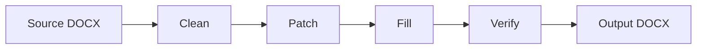

## What are Recipes?

Recipes enable OpenAgreements to work with **non-redistributable document sources** (like NVCA model financing documents) by hosting only transformation instructions rather than the original documents themselves.

A recipe contains:
- **Metadata** describing the source document and its fields
- **Replacement mappings** that transform source placeholders into template tags
- **Cleaning rules** to remove footnotes, drafting notes, and commentary
- **Normalization rules** for post-fill cleanup (optional)
- **Computed field rules** for derived values (optional)

## The Recipe Pipeline

The recipe engine processes documents through a four-stage pipeline:



### Stage 1: Clean

Removes content that shouldn't appear in the filled output:
- Footnotes and endnotes
- Drafting notes and commentary
- Preliminary sections
- Multi-paragraph comment blocks

See [cleanDocument()](/api/recipes/clean-document) for details.

### Stage 2: Patch

Transforms source placeholders into template tags:
- `[Company Name]` → `{company_name}`
- `[____________]` → `{investor_name}` (with context)
- `$[amount]` → `${purchase_price}`

The patcher handles:
- Cross-run replacements where Word splits text across XML elements
- Context-aware replacements in table rows
- Nth-occurrence targeting
- Surgical replacement preserving formatting on context text

See [patchDocument()](/api/recipes/patch-document) for details.

### Stage 3: Fill

Runs the standard template engine to fill in field values. This uses the same engine as regular templates.

### Stage 4: Verify

Validates the output document:
- All field values appear in the document
- No unrendered `{template_tags}` remain
- No leftover `[source placeholders]` remain
- Footnotes removed (if specified)
- Drafting notes removed (if specified)
- No double dollar signs (`$$`) from currency fields

## Recipe Metadata Format

Recipes are stored in `content/recipes/{recipe-id}/` with the following files:

### metadata.yaml

```yaml
name: NVCA Model Voting Agreement
description: Standard-form voting agreement for venture capital financings
source_url: https://nvca.org/wp-content/uploads/2024/10/NVCA-Model-VA-10-1-2025.docx
source_version: 10-1-2025
license_note: |
  NVCA model documents are freely downloadable but not redistributable.
  This recipe contains only transformation instructions.
source_sha256: 3496d7ae9343d1b5b7db13239313c6512e7e0d68d13273538c4dbf06416a5f0d
optional: false
fields:
  - name: company_name
    type: string
    description: Full legal name of the company
  - name: effective_date
    type: string
    description: Effective date of the agreement (e.g. January 15, 2025)
  - name: amended_restated
    type: string
    description: "Amended and Restated" or empty string
    default: ""
required_fields:
  - company_name
  - effective_date
```

### replacements.json

```json
{
  "[Company Name]": "{company_name}",
  "[________], 20[__]": "{effective_date}",
  "[Amended and Restated]": "{amended_restated}",
  "among [____________], a Delaware": "among {company_name}, a Delaware"
}
```

Keys are sorted longest-first automatically. Context text in keys enables surgical replacement.

### clean.json

```json
{
  "removeFootnotes": true,
  "removeParagraphPatterns": [
    "^Note to Drafter:",
    "^Preliminary Note\\b"
  ],
  "removeRanges": [
    {
      "start": "^MODEL INDEMNIFICATION AGREEMENT$",
      "end": "against their own directors and officers\\."
    }
  ],
  "clearParts": ["word/footer1.xml"]
}
```

### normalize.json (optional)

```json
{
  "paragraph_rules": [
    {
      "id": "fill-counsel-name",
      "section_heading": "Conditions of the Purchasers' Obligations",
      "paragraph_contains": "The Purchasers shall have received from",
      "replacements": {
        "[___________]": "{company_counsel_name}"
      },
      "trim_unmatched_trailing_bracket": true
    }
  ]
}
```

### computed.json (optional)

```json
{
  "version": "1.0",
  "max_passes": 4,
  "rules": [
    {
      "id": "derive-state-upper",
      "description": "Convert state to uppercase",
      "when_all": [{"field": "state", "op": "defined"}],
      "set_fill": {
        "state_upper": "${state}"
      }
    }
  ]
}
```

Computed fields allow deriving values from user inputs through conditional rules.

## Recipe Discovery

The recipe directory is auto-discovered from `content/recipes/`. Each subdirectory containing `metadata.yaml` is treated as a recipe.

Recipes integrate seamlessly with the template listing API:

```typescript
import { listTemplateItems } from '@openagreements/core';

const templates = await listTemplateItems();
// Returns both regular templates and recipes
// Recipes have type: 'recipe'
```

## Source Document Handling

Recipes never include the source DOCX file. When running a recipe:

1. If `inputPath` is provided, it uses that file
2. Otherwise, it auto-downloads from `source_url` in metadata
3. The downloaded file is cached in a temporary directory

This ensures license compliance while providing a seamless user experience.

## Guidance Extraction

Source documents often contain expert commentary (footnotes, drafting notes) that gets removed during cleaning. The `--extract-guidance` flag preserves this knowledge:

```bash
open-agreements recipe clean source.docx \
  --recipe nvca-indemnification-agreement \
  --extract-guidance guidance.json
```

The guidance JSON contains:
- All removed footnotes (in document order)
- Pattern-matched paragraphs
- Range-deleted sections
- Source and config hashes for staleness detection

This guidance is valuable for anyone (human or AI) filling the form, but must remain **local-only** for non-redistributable sources.

## Best Practices

### Field Defaults

Control placeholder rendering with field defaults:

- **No `default` key**: Renders as `_______` (visible placeholder)
- **`default: ""`**: Renders as empty (invisible when not provided)
- **`default: "value"`**: Uses specified default text

### Placeholder Disambiguation

When the same pattern appears multiple times with different meanings, include context:

```json
{
  "among [____________], a Delaware": "among {company_name}, a Delaware",
  "[____________] (the \u201cInvestor\u201d)": "{investor_name} (the \u201cInvestor\u201d)"
}
```

The patcher performs surgical replacement, preserving formatting on context text.

### Currency Fields

When templates have `$[amount]`, the patched version becomes `${field_name}`. To prevent double dollar signs:

- The engine automatically strips leading `$` from currency field values
- The verifier checks for `$$` patterns in output

### NVCA Bracket Types

NVCA documents use brackets for two purposes:

1. **Fill-in fields**: `[Company Name]`, `[____________]` — map these in replacements.json
2. **Optional clauses**: `[or consultant (excluding service solely as member of the Board)]` — leave as-is

Only map fill-in fields. Leave optional clauses for the drafter to decide.

## Related APIs

- [runRecipe()](/api/recipes/run-recipe) - Execute the full pipeline
- [cleanDocument()](/api/recipes/clean-document) - Stage 1: Clean
- [patchDocument()](/api/recipes/patch-document) - Stage 2: Patch
- [Template Metadata](/api/template-metadata) - Metadata schema reference
