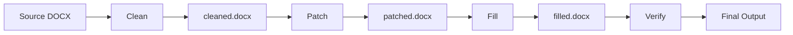

The `recipe` command manages multi-stage document processing pipelines for complex templates that require cleaning, patching, and normalization before filling.

## Syntax

```bash
open-agreements recipe <subcommand> [options]
```

## Subcommands

<CardGroup cols={2}>
  <Card title="run" icon="play">
    Run the full recipe pipeline (clean → patch → fill → verify)
  </Card>
  <Card title="clean" icon="broom">
    Run only the clean stage to remove comments and guidance
  </Card>
  <Card title="patch" icon="code-merge">
    Run only the patch stage to replace bracket placeholders
  </Card>
</CardGroup>

---

## recipe run

Run the complete recipe pipeline on a source document.

### Syntax

```bash
open-agreements recipe run <recipe-id> [options]
```

### Arguments

<ParamField path="recipe-id" type="string" required>
  Recipe identifier. Use `open-agreements list` to see available recipes.
</ParamField>

### Options

<ParamField path="-i, --input" type="string">
  Source DOCX file path. If omitted, the recipe automatically downloads the source document from the configured URL.
</ParamField>

<ParamField path="-o, --output" type="string" default="<recipe-id>-filled.docx">
  Output file path for the final DOCX document.
</ParamField>

<ParamField path="-d, --data" type="string">
  JSON file containing field values for template filling.
</ParamField>

<ParamField path="--keep-intermediate" type="flag">
  Preserve intermediate files (cleaned.docx, patched.docx) for debugging.
</ParamField>

<ParamField path="--computed-out" type="string">
  Write computed interaction artifact JSON to specified path.
</ParamField>

<ParamField path="--no-normalize-brackets" type="flag">
  Disable post-fill bracket artifact normalization.
</ParamField>

### Examples

#### Basic Usage

```bash
open-agreements recipe run nvca-term-sheet -d values.json
```

This:
1. Downloads source DOCX from nvca.org (if not cached)
2. Cleans document (removes footnotes, comments)
3. Patches placeholders (`[Name]` → `{name}`)
4. Fills with values from values.json
5. Verifies output structure
6. Writes `nvca-term-sheet-filled.docx`

#### With Custom Source

```bash
open-agreements recipe run nvca-term-sheet \
  -i ./my-modified-source.docx \
  -d values.json \
  -o term-sheet.docx
```

#### Keep Intermediate Files

```bash
open-agreements recipe run nvca-term-sheet \
  -d values.json \
  --keep-intermediate
```

Produces:
- `nvca-term-sheet-cleaned.docx` (after clean stage)
- `nvca-term-sheet-patched.docx` (after patch stage)
- `nvca-term-sheet-filled.docx` (final output)

#### With Computed Artifact

```bash
open-agreements recipe run nvca-term-sheet \
  -d values.json \
  --computed-out computed.json
```

Generates `computed.json` with field usage analysis and template metadata.

### Output

```
Filled NVCA Model Venture Capital Term Sheet
Output: /path/to/nvca-term-sheet-filled.docx
Fields used: company_name, valuation, option_pool, investor_name
```

With computed artifact:

```
Filled NVCA Model Venture Capital Term Sheet
Output: /path/to/nvca-term-sheet-filled.docx
Fields used: company_name, valuation, option_pool, investor_name
Computed artifact: /path/to/computed.json
```

---

## recipe clean

Run only the clean stage to remove footnotes, comments, and drafting guidance.

### Syntax

```bash
open-agreements recipe clean <input> [options]
```

### Arguments

<ParamField path="input" type="string" required>
  Source DOCX file to clean.
</ParamField>

### Options

<ParamField path="-o, --output" type="string" required>
  Output path for cleaned DOCX file.
</ParamField>

<ParamField path="--recipe" type="string" required>
  Recipe ID to use for clean configuration.
</ParamField>

<ParamField path="--extract-guidance" type="string">
  Extract removed content as structured JSON to specified path.
</ParamField>

### Examples

#### Basic Clean

```bash
open-agreements recipe clean source.docx \
  -o cleaned.docx \
  --recipe nvca-term-sheet
```

#### Extract Guidance

```bash
open-agreements recipe clean source.docx \
  -o cleaned.docx \
  --recipe nvca-indemnification-agreement \
  --extract-guidance guidance.json
```

**guidance.json structure:**
```json
{
  "source_hash": "abc123...",
  "config_hash": "def456...",
  "entries": [
    {
      "type": "footnote",
      "content": "This clause should be reviewed by securities counsel",
      "location": "paragraph_42"
    },
    {
      "type": "comment",
      "content": "[Comment: Consider state-specific requirements]",
      "location": "section_3"
    }
  ]
}
```

### What Gets Cleaned

Based on recipe's `clean.json` configuration:

<ResponseField name="Footnotes" type="removed">
  Explanatory footnotes (preserves structural footnotes)
</ResponseField>

<ResponseField name="Comments" type="removed">
  Inline comments matching pattern `[Comment: ...]`
</ResponseField>

<ResponseField name="Drafting Notes" type="removed">
  Text blocks marked for removal (varies by recipe)
</ResponseField>

<ResponseField name="Guidance Text" type="removed">
  Expert commentary and drafting instructions
</ResponseField>

### Output

```
Cleaned: cleaned.docx
```

With guidance extraction:

```
Cleaned: cleaned.docx
Guidance: guidance.json (27 entries)
```

---

## recipe patch

Run only the patch stage to replace bracket placeholders with template tags.

### Syntax

```bash
open-agreements recipe patch <input> [options]
```

### Arguments

<ParamField path="input" type="string" required>
  Cleaned DOCX file to patch.
</ParamField>

### Options

<ParamField path="-o, --output" type="string" required>
  Output path for patched DOCX file.
</ParamField>

<ParamField path="--recipe" type="string" required>
  Recipe ID to use for replacement mappings.
</ParamField>

### Examples

```bash
open-agreements recipe patch cleaned.docx \
  -o patched.docx \
  --recipe nvca-term-sheet
```

### What Gets Patched

Based on recipe's `replacements.json`:

```json
{
  "[Company Name]": "{company_name}",
  "[Valuation Cap]": "{valuation_cap}",
  "[Investment Amount]": "{investment_amount}"
}
```

The patcher:
1. Finds all bracket placeholders in document
2. Replaces with corresponding `{tag}` format
3. Skips long clauses (>80 chars, assumed to be alternatives)

### Output

```
Patched: patched.docx
```

---

## Recipe Pipeline

Understanding the full pipeline:



### Stage Details

<Steps>
  <Step title="Download (if needed)">
    If no input file specified, download source from recipe URL and verify hash.
  </Step>
  
  <Step title="Clean">
    Remove footnotes, comments, and guidance using recipe's `clean.json` configuration.
  </Step>
  
  <Step title="Patch">
    Replace bracket placeholders with template tags using `replacements.json` mappings.
  </Step>
  
  <Step title="Fill">
    Fill template tags with provided values using docx-templates engine.
  </Step>
  
  <Step title="Verify">
    Validate output structure and check for unfilled placeholders.
  </Step>
</Steps>

## Available Recipes

NVCA Model Legal Documents (downloaded from nvca.org):

- `nvca-term-sheet` - Venture Capital Term Sheet
- `nvca-stock-purchase-agreement` - Stock Purchase Agreement
- `nvca-charter` - Certificate of Incorporation
- `nvca-rofr-co-sale-agreement` - Right of First Refusal and Co-Sale Agreement
- `nvca-investors-rights-agreement` - Investors' Rights Agreement
- `nvca-voting-agreement` - Voting Agreement
- `nvca-indemnification-agreement` - Indemnification Agreement

List all recipes:

```bash
open-agreements list | grep recipe
```

## Troubleshooting

<AccordionGroup>
  <Accordion title="Recipe Not Found">
    ```
    Recipe "recipe-name" not found.
    Available recipes: nvca-term-sheet, nvca-charter, ...
    ```
    
    **Solution**: Use `open-agreements list` to see available recipes.
  </Accordion>

  <Accordion title="Download Failed">
    ```
    Error: Failed to download source document from https://...
    ```
    
    **Solution**: Check internet connection or provide local source with `-i` flag:
    ```bash
    open-agreements recipe run nvca-term-sheet -i ./local-source.docx -d values.json
    ```
  </Accordion>

  <Accordion title="Hash Mismatch">
    ```
    Error: Source hash mismatch (expected abc123, got def456)
    ```
    
    **Solution**: The source document has changed. This is a canary check. Update recipe configuration or report issue.
  </Accordion>

  <Accordion title="Unfilled Placeholders">
    ```
    WARN: Unfilled placeholders found: {missing_field}
    ```
    
    **Solution**: Add missing field to values.json:
    ```json
    {
      "missing_field": "value here"
    }
    ```
  </Accordion>
</AccordionGroup>

## Guidance Extraction

Recipe sources contain expert commentary (footnotes, drafting notes) written by domain specialists. The `--extract-guidance` flag preserves this knowledge:

### Why Extract Guidance?

<Check>Preserves expert commentary verbatim</Check>
<Check>Captures source-of-truth language</Check>
<Check>Enables AI-assisted drafting with authoritative context</Check>
<Check>Zero manual effort after publisher updates</Check>

### Guidance Format

```json
{
  "source_hash": "sha256 of source document",
  "config_hash": "sha256 of clean.json",
  "entries": [
    {
      "type": "footnote",
      "content": "Full footnote text",
      "location": "approximate paragraph/section"
    },
    {
      "type": "comment",
      "content": "[Comment: drafting note]",
      "location": "section identifier"
    }
  ]
}
```

### Using Guidance

1. Extract once: `--extract-guidance guidance.json`
2. Reference during filling (AI agents can read guidance.json)
3. Re-extract after source updates
4. Keep guidance.json local (not committed to repo)

## Best Practices

<Tip>
  Use `--keep-intermediate` when developing recipes to debug each stage.
</Tip>

<Tip>
  Extract guidance for AI-assisted filling workflows:
  ```bash
  open-agreements recipe clean source.docx -o cleaned.docx \
    --recipe nvca-term-sheet --extract-guidance guidance.json
  ```
</Tip>

<Warning>
  Recipe sources are not redistributable. They're downloaded at runtime and processed locally.
</Warning>

## See Also

- [fill](/cli/fill) - Fill templates (works with recipes automatically)
- [scan](/cli/scan) - Scan DOCX for placeholders
- [Adding Recipes](../templates/recipes) - Create new recipes
