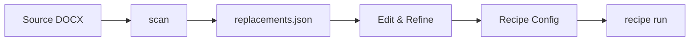

The `scan` command analyzes DOCX files to identify bracketed placeholders, classify them by type, and optionally generate a draft `replacements.json` file for recipe creation.

## Syntax

```bash
open-agreements scan <input> [options]
```

## Arguments

<ParamField path="input" type="string" required>
  Path to DOCX file to scan.
</ParamField>

## Options

<ParamField path="--output-replacements" type="string">
  Generate a draft replacements.json file with suggested tag mappings.
</ParamField>

## Examples

### Basic Scan

```bash
open-agreements scan source-document.docx
```

**Output:**
```
=== Scan of source-document.docx ===

Short placeholders (15):
  [Company Name]
  [Company Address]
  [Investor Name]
  [Investment Amount]
  [Valuation Cap]
  [Discount Rate]
  [Effective Date]
  [State of Incorporation]
  [Number of Shares]
  [Purchase Price]
  [Governing Law]
  [Signatory Name]
  [Signatory Title]
  [Email Address]
  [Phone Number]

Long clauses/alternatives (3) — skipped by recipe:
  [If the Company completes an equity financing with gross proceed...]
  [In the event of a Change of Control, the Safe will automaticall...]
  [The Company shall maintain directors and officers insurance cov...]

Footnotes: 12 explanatory footnote(s)

Underscore blanks: 8 occurrence(s)
```

### Generate Replacements File

```bash
open-agreements scan source-document.docx --output-replacements replacements.json
```

**Output:**
```
=== Scan of source-document.docx ===

Short placeholders (15):
  [Company Name]
  [Investor Name]
  ...

Long clauses/alternatives (3) — skipped by recipe:
  ...

Footnotes: 12 explanatory footnote(s)
Underscore blanks: 8 occurrence(s)

Draft replacements written to: replacements.json
```

**replacements.json:**
```json
{
  "[Company Name]": "{company_name}",
  "[Company Address]": "{company_address}",
  "[Investor Name]": "{investor_name}",
  "[Investment Amount]": "{investment_amount}",
  "[Valuation Cap]": "{valuation_cap}",
  "[Discount Rate]": "{discount_rate}",
  "[Effective Date]": "{effective_date}",
  "[State of Incorporation]": "{state_of_incorporation}",
  "[Number of Shares]": "{number_of_shares}",
  "[Purchase Price]": "{purchase_price}",
  "[Governing Law]": "{governing_law}",
  "[Signatory Name]": "{signatory_name}",
  "[Signatory Title]": "{signatory_title}",
  "[Email Address]": "{email_address}",
  "[Phone Number]": "{phone_number}"
}
```

### Scan with Additional Parts

If the document has headers, footers, or endnotes:

```bash
open-agreements scan complex-document.docx
```

**Output:**
```
=== Scan of complex-document.docx ===
Parts scanned: document.xml + 3 additional (header1.xml, footer1.xml, endnotes.xml)

Short placeholders (20):
  [Company Name]
  [Document Date]  (also in: header1.xml)
  [Page Footer Text]  (also in: footer1.xml)
  ...

Long clauses/alternatives (2) — skipped by recipe:
  ...

Footnotes: 5 explanatory footnote(s)
Underscore blanks: 3 occurrence(s)
```

## What Gets Scanned

The scanner analyzes all text content in:

<ResponseField name="Main Document" type="scanned">
  Primary document text (word/document.xml)
</ResponseField>

<ResponseField name="Headers" type="scanned">
  All header parts (header1.xml, header2.xml, etc.)
</ResponseField>

<ResponseField name="Footers" type="scanned">
  All footer parts (footer1.xml, footer2.xml, etc.)
</ResponseField>

<ResponseField name="Endnotes" type="scanned">
  Endnote content (endnotes.xml)
</ResponseField>

<ResponseField name="Footnotes" type="counted">
  Footnote count reported (footnotes.xml)
</ResponseField>

## Placeholder Classification

Placeholders are classified by length:

### Short Placeholders (≤80 characters)

Intended as fill-in fields:

```
[Company Name]
[Effective Date]
[Investment Amount]
```

These are:
- Included in generated replacements.json
- Converted to `{tag}` format during recipe patch stage
- Expected to be filled with data values

### Long Clauses (>80 characters)

Alternative text or conditional clauses:

```
[If the Company completes an equity financing with gross proceeds...]
[In the event of a Change of Control, the Safe will automatically...]
```

These are:
- Skipped by recipe processing
- Assumed to be alternative clauses requiring manual selection
- Not included in replacements.json

## Underscore Blanks

The scanner detects underscore-style blanks (`___`) common in legal documents:

```
Signed: _________________
Date: __________
```

Count reported but no automatic conversion (typically formatting artifacts).

## Footnote Detection

Footnotes are classified as:

<ResponseField name="Explanatory" type="counted">
  Author commentary, drafting notes, guidance
</ResponseField>

<ResponseField name="Structural" type="ignored">
  Separators and continuation markers (excluded from count)
</ResponseField>

Explanatory footnotes are typically removed during recipe clean stage.

## Tag Name Generation

When generating replacements.json, placeholder text is converted to tags:

```
[Company Name]       → {company_name}
[Investment Amount]  → {investment_amount}
[State of Inc.]      → {state_of_inc}
[E-mail]             → {e_mail}
```

Algorithm:
1. Remove brackets
2. Convert to lowercase
3. Replace non-alphanumeric sequences with `_`
4. Trim leading/trailing underscores

## Use Cases

<AccordionGroup>
  <Accordion title="Recipe Development">
    Scan source documents to identify placeholders before creating a recipe:
    
    ```bash
    open-agreements scan source.docx --output-replacements replacements.json
    ```
    
    Then customize replacements.json and add to recipe.
  </Accordion>

  <Accordion title="Template Analysis">
    Understand what fields a document requires:
    
    ```bash
    open-agreements scan template.docx
    ```
    
    Review short placeholders to plan data collection.
  </Accordion>

  <Accordion title="Document Complexity Assessment">
    Evaluate document complexity before creating a recipe:
    
    ```bash
    open-agreements scan complex-doc.docx
    ```
    
    High counts of long clauses suggest manual clause selection may be needed.
  </Accordion>

  <Accordion title="Content Audit">
    Identify all placeholders across document parts:
    
    ```bash
    open-agreements scan document.docx | grep "also in:"
    ```
    
    Finds placeholders in headers/footers that might be missed.
  </Accordion>
</AccordionGroup>

## Workflow: Creating a Recipe

<Steps>
  <Step title="Scan Source Document">
    ```bash
    open-agreements scan source.docx --output-replacements replacements.json
    ```
  </Step>
  
  <Step title="Review and Customize">
    Edit replacements.json to:
    - Adjust tag names for consistency
    - Remove unwanted placeholders
    - Add manual mappings
  </Step>
  
  <Step title="Create Recipe Directory">
    ```bash
    mkdir -p content/recipes/my-recipe
    cp replacements.json content/recipes/my-recipe/
    ```
  </Step>
  
  <Step title="Add Clean Config">
    Create `content/recipes/my-recipe/clean.json` with footnote removal rules.
  </Step>
  
  <Step title="Add Metadata">
    Create `content/recipes/my-recipe/recipe.yaml` with source URL and fields.
  </Step>
  
  <Step title="Test Recipe">
    ```bash
    open-agreements recipe run my-recipe -d test-values.json
    ```
  </Step>
</Steps>

## Troubleshooting

<AccordionGroup>
  <Accordion title="File Not Found">
    ```
    File not found: source.docx
    ```
    
    **Solution**: Verify file path and ensure file exists:
    ```bash
    ls -l source.docx
    open-agreements scan "$(pwd)/source.docx"
    ```
  </Accordion>

  <Accordion title="No Placeholders Found">
    ```
    Short placeholders (0):
    Long clauses/alternatives (0) — skipped by recipe:
    ```
    
    **Solution**: Document may use different placeholder format. Check if document uses:
    - `{tags}` instead of `[brackets]`
    - `«chevrons»`
    - `__blanks__`
    
    The scan command specifically looks for `[bracket]` format.
  </Accordion>

  <Accordion title="Invalid DOCX">
    ```
    Error: Cannot read DOCX structure
    ```
    
    **Solution**: File may be corrupted or not a valid DOCX:
    ```bash
    file source.docx  # Check file type
    unzip -t source.docx  # Verify ZIP structure
    ```
  </Accordion>

  <Accordion title="Missing Placeholders in Scan">
    If you know placeholders exist but aren't found:
    
    **Possible causes**:
    - Placeholder split across multiple runs (formatting artifact)
    - Placeholder in text box or shape (not scanned)
    - Placeholder in track changes (not in final text)
    
    **Solution**: Open document in Word and check for split text or special containers.
  </Accordion>
</AccordionGroup>

## Output Examples

<CodeGroup>
```bash Simple Document
=== Scan of simple-nda.docx ===

Short placeholders (8):
  [Party A Name]
  [Party B Name]
  [Effective Date]
  [Term in Days]
  [Governing Law]
  [Party A Signatory]
  [Party B Signatory]
  [Witness Name]

Long clauses/alternatives (0) — skipped by recipe:

Footnotes: 0 explanatory footnote(s)
Underscore blanks: 2 occurrence(s)
```

```bash Complex Document with Guidance
=== Scan of nvca-term-sheet.docx ===
Parts scanned: document.xml + 2 additional (header1.xml, footer1.xml)

Short placeholders (42):
  [Company Name]
  [Company Address]
  [Document Date]  (also in: header1.xml)
  [Investor Names]
  [Amount Invested]
  ...

Long clauses/alternatives (12) — skipped by recipe:
  [In the event the Company consummates a Qualified Financing pri...]
  [If the Company issues any shares of Common Stock or securities...]
  [Subject to the approval of the Board of Directors, including t...]
  ...

Footnotes: 27 explanatory footnote(s)
Underscore blanks: 15 occurrence(s)
```

```bash Generated replacements.json
{
  "[Company Name]": "{company_name}",
  "[Company Address]": "{company_address}",
  "[Document Date]": "{document_date}",
  "[Investor Names]": "{investor_names}",
  "[Amount Invested]": "{amount_invested}",
  "[Pre-Money Valuation]": "{pre_money_valuation}",
  "[Option Pool %]": "{option_pool_percent}",
  "[Liquidation Multiple]": "{liquidation_multiple}",
  "[Board Size]": "{board_size}",
  "[Founders]": "{founders}",
  "[State of Incorporation]": "{state_of_incorporation}"
}
```
</CodeGroup>

## Integration with Recipe Pipeline

The scan command is part of the recipe creation workflow:



Scan identifies placeholders → you customize mappings → recipe uses mappings during patch stage.

## Best Practices

<Tip>
  Always review generated replacements.json. Automated tag names may need adjustment for clarity:
  
  ```json
  // Generated
  "[Co. Name]": "{co_name}"
  
  // Better
  "[Co. Name]": "{company_name}"
  ```
</Tip>

<Tip>
  Scan documents early in recipe development to understand complexity and plan clean/patch stages.
</Tip>

<Warning>
  Long clauses (>80 chars) are automatically skipped by recipe processing. If you need to handle these, manual clause selection logic is required.
</Warning>

## See Also

- [recipe](/cli/recipe) - Use scan results to build recipes
- [Adding Recipes](../templates/recipes) - Complete recipe creation guide
